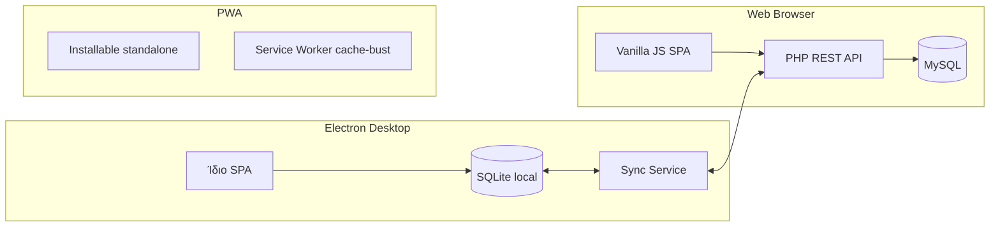
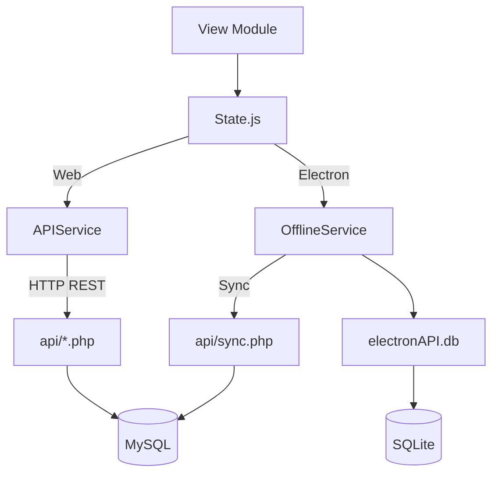

# Αρχιτεκτονική — Τέχνη και Χρώμα

> **Σχετικά έγγραφα:** [Βάση δεδομένων & API](database-and-api.md) · [UI & Workflows](ui-and-workflows.md) · [Refactor Roadmap](refactor-roadmap.md)

## Επισκόπηση

**Τέχνη και Χρώμα** (εσωτερικό όνομα: *Οργανωτής Βαφέα Pro*) είναι εφαρμογή διαχείρισης επιχείρησης βαφέων. Καλύπτει τον πλήρη κύκλο εργασίας: πελάτες, εργασίες με οικονομικά, προσωπικό, αποθήκη υλικών, προμηθευτές, ημερολόγιο επισκέψεων, χάρτη, στατιστικά και ρυθμίσεις.

**Target user:** Μοναδικός διαχειριστής επιχείρησης (ιδιοκτήτης βαφείου). Δεν υπάρχει σύστημα ρόλων ή πολλαπλών χρηστών — όλες οι λειτουργίες είναι διαθέσιμες σε έναν χρήστη.

## Τρόποι εκτέλεσης



| Τρόπος | Τεχνολογία | Δεδομένα | Χρήση |
|--------|-----------|----------|-------|
| **Web** | Browser + PHP/MySQL | Server-side MySQL | Κύρια χρήση online |
| **Electron** | Desktop app + SQLite | Τοπική SQLite + sync | Offline CRUD, sync προς server |
| **PWA** | Εγκατάσταση στο κινητό | Ίδιο με Web | Install shortcut, όχι offline CRUD |

## Tech Stack

### Frontend

| Στοιχείο | Τεχνολογία |
|----------|-----------|
| Framework | Plain JavaScript (χωρίς bundler/framework) |
| Routing | Hash-based SPA (`#dashboard`, `#jobs?jobId=123`) |
| Views | Global modules `window.*View` (π.χ. `JobsView`, `ClientsView`) |
| CSS | Custom design tokens (`variables.css`), feature-specific CSS files |
| Charts | Chart.js |
| Calendar | FullCalendar 6 (Greek locale) |
| Maps | Google Maps (primary), Leaflet/OSM (fallback) |
| Date picker | Flatpickr (Greek locale) |
| Excel export | ExcelJS (client-side) |
| Icons | Font Awesome 6 |

### Backend

| Στοιχείο | Τεχνολογία |
|----------|-----------|
| API | PHP REST endpoints (`api/*.php`) |
| Database | MySQL (production), PDO |
| Auth | PHP sessions + remember-me cookie |
| Logging | `config/logger.php` → `logs/` |
| Secrets | `config/secrets.php` / `config/secrets.local.php` |

### Desktop (Electron)

| Στοιχείο | Τεχνολογία |
|----------|-----------|
| Runtime | Electron (`electron/main.js`) |
| Local DB | SQLite (`electron/db/sqlite.js`) |
| Sync | `electron/db/sync.js` ↔ `api/sync.php` |
| IPC | `electron/preload.js` → `window.electronAPI` |

## Δομή φακέλων

```
nikolpaintmaster.e-gata.gr/
├── api/                    # PHP REST endpoints
│   ├── auth.php            # Login/logout/check
│   ├── auth_check.php      # Session + sync key guard
│   ├── clients.php, jobs.php, workers.php, ...
│   ├── calendar_helpers.php, job_financials.php
│   ├── warehouse_schema.php, job_visits_schema.php
│   └── sync.php            # Electron upload endpoint
├── config/
│   ├── database.php        # PDO connection
│   ├── secrets.php         # Credentials (env / local override)
│   └── google.php          # Google OAuth + Calendar
├── database/
│   ├── schema.sql          # Canonical CREATE TABLE
│   └── reset_and_import.sql
├── electron/
│   ├── main.js             # Electron main process
│   ├── preload.js          # IPC bridge
│   └── db/
│       ├── sqlite.js       # Local SQLite CRUD
│       └── sync.js         # Download/upload sync
├── public/
│   ├── index.html          # SPA shell + sidebar
│   ├── login.html          # Admin login
│   ├── manifest.json       # PWA manifest
│   ├── sw.js               # Service worker
│   └── src/
│       ├── css/            # Feature CSS (dashboard, modals, sidebar, ...)
│       └── js/
│           ├── app.js      # Boot sequence
│           ├── router.js   # Hash router
│           ├── state.js    # Global state + CRUD
│           ├── domain/     # Shared business logic
│           │   ├── job-financials.js
│           │   └── data-mappers.js
│           ├── services/
│           │   ├── api.js          # Web/Electron API routing
│           │   ├── offline.js      # Electron SQLite IPC
│           │   └── settings-service.js
│           ├── views/      # Screen modules (jobs, clients, ...)
│           └── ui-primitives.js
└── docs/                   # Τεκμηρίωση
```

## Boot Sequence

Η εφαρμογή ξεκινά από `app.js` με τη σειρά:

1. `Theme.init()` — dark/light mode
2. `State.init()` — φόρτωση δεδομένων (API ή SQLite)
3. `SettingsService.loadAll()` — ρυθμίσεις από DB
4. `i18n.init()` — ελληνικά strings
5. `Sidebar.init()` — πλοήγηση
6. `Keyboard.init()` — shortcuts
7. `Toast.init()`, `Modal.init()`
8. `Router.init()` — αρχική route (`#dashboard`)

## Data Flow



### State (`state.js`)

Κεντρικός διαχειριστής κατάστασης. Φορτώνει και κρατά in-memory collections:

`clients`, `workers`, `inventory` (materials), `materialStockMovements`, `suppliers`, `materialPurchases`, `supplierPayments`, `jobs`, `jobPayments`, `offers`, `invoices`, `templates`, `timesheets` (stub κενό)

**Ευθύνες:**
- CRUD routing → `APIService` ή `OfflineService`
- Undo/redo (τελευταία 10 snapshots στη μνήμη)
- Search, filters, pagination helpers
- Cross-view refresh hooks (dashboard, calendar, jobs, workers)

**Σημείωση:** Το `State` κάνει περισσότερα από pure state — routing, linked deletes, cache mutation. Αυτό αποτελεί τεχνικό χρέος (βλ. [refactor-roadmap](refactor-roadmap.md) milestone 4).

### APIService (`services/api.js`)

- **Web:** `baseURL = /api` (ή `localhost:8000/api` σε dev)
- **Electron:** Πάντα SQLite μέσω `OfflineService` (δεν καλεί PHP απευθείας για CRUD)
- Session cookies: `credentials: 'include'`
- Entity mapping: `inventory` ↔ `materials` API

### OfflineService (`services/offline.js`)

Μόνο σε Electron. CRUD μέσω `window.electronAPI.db.*` και sync μέσω `electronAPI.sync.*`.

## Domain Layer

Κοινή business logic που μειώνει duplication μεταξύ views:

| Module | Αρχείο | Ρόλος |
|--------|--------|-------|
| `JobFinancials` | `domain/job-financials.js` | Υπολογισμοί P&L: billing, έξοδα, profit, balance, owner opportunity cost |
| `DataMappers` | `domain/data-mappers.js` | Response unwrapping, ID normalization, snake_case/camelCase, JSON parsing |

Χρησιμοποιούνται από: Jobs, Dashboard, Statistics, Workers, Clients.

## UI Layer

| Module | Ρόλος |
|--------|-------|
| `UIPrimitives` | `statusBadge`, `emptyState`, `actionButton` |
| `Modal` | `open`, `close`, `confirm`, `alert`, `form`, `show` (sizes: sm/lg/xl/full) |
| `BaseView` | Event listener tracking + `cleanup()` — χρησιμοποιείται επιλεκτικά |
| `Toast` | Ειδοποιήσεις επιτυχίας/σφάλματος |
| `Sidebar` | Πλοήγηση, mobile toggle |
| `Theme` | Dark/light mode (`localStorage`) |

## Authentication

### Web

- **Login:** [`public/login.html`](../public/login.html) → `POST /api/auth.php?action=login`
- **Session:** PHP `$_SESSION['authenticated']`, timeout **2 ώρες** (ανανεώνεται σε κάθε request)
- **Remember me:** Cookie `remember_token` (30 ημέρες), hash αποθηκευμένο στο `google_meta`
- **Password:** Bcrypt hash (`ADMIN_PASSWORD_HASH`) ή plaintext fallback (`ADMIN_PASSWORD`) από `config/secrets.php`
- **Guard:** `api/auth_check.php` → `checkAuthentication()` σε όλα τα endpoints εκτός `auth.php`, `geocode.php`, `backup.php`

### Sync API Key

Το `api/sync.php` δέχεται επίσης header `X-Sync-API-Key` (default: `electron-sync-key-2025` από env `SYNC_API_KEY`).

### Electron

Δεν έχει ξεχωριστό login — χρησιμοποιεί το ίδιο SPA. CRUD γίνεται τοπικά στο SQLite.

## Deployment Modes — Ποιο path ανά λειτουργία

| Λειτουργία | Web | Electron |
|-----------|-----|----------|
| CRUD (clients, jobs, ...) | PHP API → MySQL | SQLite local |
| Statistics | `statistics.php` API | Client-side aggregation από SQLite |
| Calendar events | Backend upsert on job save | `syncJobsToCalendar()` στο Calendar view load |
| Geocoding | PHP proxy `geocode.php` | Direct Nominatim API |
| Google Calendar | OAuth + `google_calendar.php` | Δεν διαθέσιμο |
| Backup JSON | `backup.php` export/import | Settings UI (JSON + Excel client-side) |
| Sync | — | Download (overwrite local) / Upload (push pending) |

## Εξωτερικές ενσωματώσεις

| Υπηρεσία | Χρήση | Αρχεία |
|----------|-------|--------|
| **Google Maps** | Dashboard mini-map, Map view, geocoding fallback | `index.html`, `map.js`, `maps-loader.js` |
| **Leaflet/OSM** | Fallback map tiles | `map.js` |
| **Nominatim** | Geocoding διευθύνσεων πελατών | `geocode.php`, `geocoding.js` |
| **Google Calendar** | OAuth2, bidirectional sync events | `google_oauth.php`, `google_calendar.php`, `config/google.php` |
| **Chart.js** | Dashboard doughnut, Statistics charts | `dashboard.js`, `statistics.js` |
| **FullCalendar** | Ημερολόγιο επισκέψεων | `calendar.js` |
| **Flatpickr** | Date/time pickers | `datepicker.js` |
| **ExcelJS** | Excel export από Settings | `settings.js` |

## PWA

| Στοιχείο | Λεπτομέρεια |
|----------|------------|
| Manifest | [`public/manifest.json`](../public/manifest.json) — `standalone`, Greek, scope `/public/` |
| Service Worker | [`public/sw.js`](../public/sw.js) — version `20260615a` |
| Σκοπός SW | Cache invalidation (`cache: 'no-store'`) για fresh deploys — **όχι** offline entity caching |
| Install | Εγκατάσταση ως standalone app στο κινητό/desktop |

## Γνωστά Gaps & Τεχνικό Χρέος

Από audit ([refactor-roadmap.md](refactor-roadmap.md)):

### Frontend
- Μεγάλα monolithic views: `jobs.js`, `calendar.js`, `dashboard.js`, `statistics.js`
- Διπλή/τριπλή οικονομική λογική (μερικώς λυμένη με `JobFinancials`)
- `BaseView` υπάρχει αλλά δεν χρησιμοποιείται συστηματικά
- Legacy CSS tokens (`--text`, `--bg`, `--border`) παράλληλα με canonical `--color-*`
- Global selector collisions (`.detail-grid`, `.form-actions`, `.tabs-nav`)
- List screens σε κινητό: μερική μετάβαση σε card lists (Clients, Workers, Jobs, Stock, Inventory)

### Data Layer
- Δύο write paths (Web API vs Electron SQLite) με duplicated business logic
- Sync manifest στο Electron δεν καλύπτει όλα τα ενεργά tables (π.χ. `material_stock_movements`, `job_visits`, `job_payments`, `suppliers`)
- Direct SQL/renderer paths σε calendar/statistics (μερικώς βελτιωμένα)

### Features
- **Offers, Invoices, Templates:** Backend CRUD έτοιμο, UI placeholder
- **Timesheets:** Legacy table dropped, stub στο State
- **Global search / FAB:** Κώδικας στο `app.js`/`keyboard.js` χωρίς αντίστοιχα DOM elements στο `index.html`
- **backup.php:** Χωρίς authentication (security gap)

### Αρχεία-ορφανά
- `public/src/js/views/clients-refactored.js` — δεν φορτώνεται

## Σχετικά έγγραφα

- [Βάση δεδομένων & API Reference](database-and-api.md)
- [UI Οθόνες & Workflows](ui-and-workflows.md)
- [Refactor Roadmap](refactor-roadmap.md)
