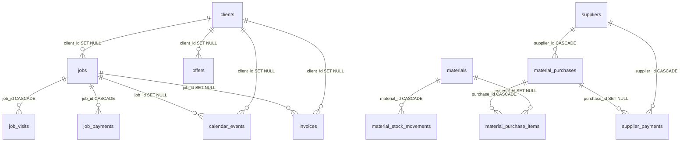
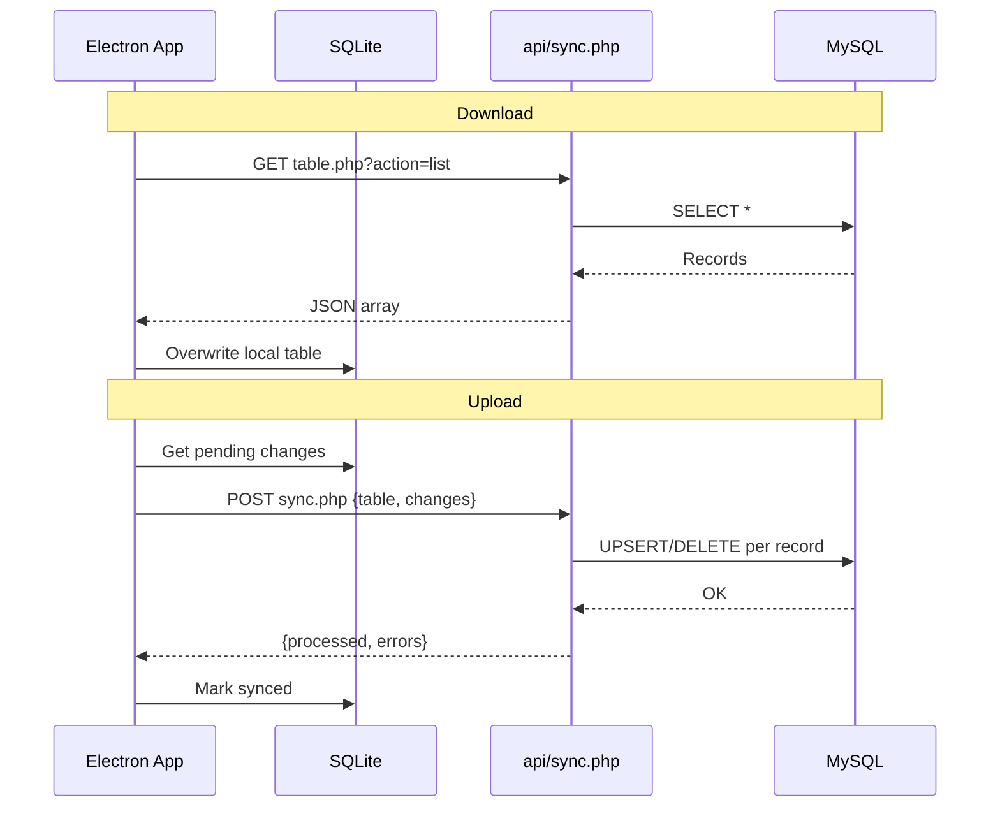

# Βάση Δεδομένων & API — Τέχνη και Χρώμα

> **Σχετικά έγγραφα:** [Αρχιτεκτονική](architecture.md) · [UI & Workflows](ui-and-workflows.md)

## Πηγές Schema

| Αρχείο | Περιγραφή |
|--------|-----------|
| [`database/schema.sql`](../database/schema.sql) | Canonical `CREATE TABLE` definitions |
| [`database/reset_and_import.sql`](../database/reset_and_import.sql) | Reset + seed data (auto-generated) |
| Runtime helpers | `warehouse_schema.php`, `job_visits_schema.php`, `calendar_helpers.php`, `material_identity.php` |

Δεν υπάρχουν formal migration files. Το schema εξελίσσεται runtime με `CREATE TABLE IF NOT EXISTS` και `ALTER TABLE` στα πρώτα API hits.

### Legacy πίνακες (αφαιρεμένοι)

Οι πίνακες `timesheets`, `job_materials`, `job_workers` έχουν αντικατασταθεί:
- Υλικά εργασίας → JSON field `jobs.paints`
- Εργάτες εργασίας → JSON field `jobs.assigned_workers`
- Επισκέψεις με ώρες → πίνακας `job_visits` (ξεχωριστό API)

---

## Entity Relationship Diagram



---

## Πίνακες Βάσης Δεδομένων

### `clients` — Πελάτες

| Στήλη | Τύπος | Περιγραφή |
|-------|-------|-----------|
| `id` | INT PK | Auto-increment |
| `name` | VARCHAR(255) NOT NULL | Όνομα πελάτη |
| `phone`, `email` | VARCHAR | Επικοινωνία |
| `address`, `city`, `postal_code` | TEXT/VARCHAR | Διεύθυνση |
| `afm` | VARCHAR(20) | ΑΦΜ |
| `notes` | TEXT | Σημειώσεις |
| `coordinates` | JSON | `{lat, lng}` για χάρτη |
| `created_at`, `updated_at` | TIMESTAMP | Audit |

### `workers` — Προσωπικό

| Στήλη | Τύπος | Περιγραφή |
|-------|-------|-----------|
| `id` | INT PK | |
| `name` | VARCHAR(255) NOT NULL | |
| `phone`, `specialty` | VARCHAR | |
| `hourly_rate`, `daily_rate` | DECIMAL(10,2) | Τιμές |
| `worker_type` | ENUM(`employee`,`owner`) | Υπάλληλος ή ιδιοκτήτης |
| `status` | ENUM(`active`,`inactive`) | |
| `hire_date` | DATE | |
| `total_hours`, `total_earnings` | DECIMAL | Aggregated stats |
| `notes` | TEXT | |

**Σημείωση:** Δεν υπάρχει FK προς `jobs`. Οι εργάτες αναφέρονται μέσα στο JSON `jobs.assigned_workers`.

### `materials` — Υλικά αποθήκης

| Στήλη | Τύπος | Περιγραφή |
|-------|-------|-----------|
| `id` | INT PK | |
| `name` | VARCHAR(255) NOT NULL | |
| `unit` | VARCHAR(50) | lt, kg, τεμ. |
| `unit_price` | DECIMAL(10,2) | Τιμή μονάδας |
| `stock` | DECIMAL(10,2) | Τρέχον απόθεμα |
| `min_stock` | DECIMAL(10,2) | Όριο ειδοποίησης |
| `category` | VARCHAR(100) | Κατηγορία (π.χ. Χρώμα) |
| `color_code` | VARCHAR(100) | Κωδικός χρώματος |
| `canonical_key` | VARCHAR(512) | Κλειδί για duplicate detection |

### `suppliers` — Καταστήματα / Προμηθευτές

| Στήλη | Τύπος |
|-------|-------|
| `id` | INT PK |
| `name` | VARCHAR(255) NOT NULL |
| `phone`, `email`, `address`, `notes` | |

### `material_purchases` — Αγορές υλικών

| Στήλη | Τύπος | Περιγραφή |
|-------|-------|-----------|
| `id` | INT PK | |
| `supplier_id` | INT FK → suppliers CASCADE | |
| `purchase_date` | DATE NOT NULL | |
| `reference_number` | VARCHAR(100) | Αριθμός παραστατικού |
| `total_cost` | DECIMAL(10,2) | Άθροισμα γραμμών |
| `notes` | TEXT | |

### `material_purchase_items` — Γραμμές αγοράς

| Στήλη | Τύπος | Περιγραφή |
|-------|-------|-----------|
| `id` | INT PK | |
| `purchase_id` | INT FK CASCADE | |
| `material_id` | INT FK SET NULL | Δημιουργείται αυτόματα αν λείπει |
| `material_name` | VARCHAR(255) NOT NULL | |
| `quantity`, `unit`, `unit_price`, `total_cost` | DECIMAL/VARCHAR | |
| `notes` | TEXT | |

**Side effect:** Δημιουργία/ενημέρωση `materials` και αύξηση `stock`.

### `supplier_payments` — Πληρωμές προμηθευτών

| Στήλη | Τύπος | Περιγραφή |
|-------|-------|-----------|
| `id` | INT PK | |
| `supplier_id` | INT FK CASCADE | |
| `purchase_id` | INT FK SET NULL | Προαιρετική σύνδεση με αγορά |
| `payment_date` | DATE NOT NULL | |
| `amount` | DECIMAL(10,2) NOT NULL | |
| `payment_method` | VARCHAR(100) | |
| `notes` | TEXT | |

### `material_stock_movements` — Κινήσεις αποθήκης

| Στήλη | Τύπος | Περιγραφή |
|-------|-------|-----------|
| `id` | INT PK | |
| `material_id` | INT FK CASCADE | |
| `movement_date` | DATE NOT NULL | |
| `movement_type` | VARCHAR(50) | `add`, `remove`, `adjust` |
| `quantity` | DECIMAL(10,2) | |
| `previous_stock`, `new_stock` | DECIMAL(10,2) | Audit trail |
| `unit` | VARCHAR(50) | |
| `reference_type`, `reference_id` | VARCHAR/INT | Π.χ. `job`, ID εργασίας |
| `notes` | TEXT | |

### `jobs` — Εργασίες

| Στήλη | Τύπος | Περιγραφή |
|-------|-------|-----------|
| `id` | INT PK | |
| `client_id` | INT FK SET NULL | |
| `title`, `type` | VARCHAR | Τίτλος, τύπος εργασίας |
| `date` | DATE | Ημερομηνία δημιουργίας |
| `next_visit` | DATE | Επόμενη επίσκεψη |
| `visit_end_date` | DATE | Λήξη πολυήμερης επίσκεψης |
| `visit_start_time`, `visit_end_time` | TIME | Ώρες επίσκεψης |
| `visit_all_day` | TINYINT(1) | Ολοήμερη επίσκεψη |
| `address` | TEXT | Διεύθυνση εργασίας |
| `rooms` | INT | Αριθμός δωματίων |
| `area` | DECIMAL(10,2) | Τετραγωνικά |
| `materials_cost` | DECIMAL(10,2) | Κόστος υλικών |
| `kilometers` | DECIMAL(10,2) | Χιλιόμετρα μετακίνησης |
| `billing_hours`, `billing_rate` | DECIMAL | Χρεώσιμες ώρες × τιμή |
| `billing_type` | VARCHAR(20) | `hourly` ή `fixed` |
| `agreed_price` | DECIMAL(10,2) | Συμφωνημένη τιμή (κατ' αποκοπή) |
| `cost_per_km` | DECIMAL(10,2) | Κόστος ανά km (default 0.50) |
| `notes` | TEXT | |
| `assigned_workers` | JSON | `[{workerId, name, hoursAllocated, hourlyRate, workerType, laborCost}]` |
| `paints` | JSON | `[{materialId, name, quantity, unit, unitPrice, totalCost}]` |
| `status` | VARCHAR(50) | Βλ. κατάσταση εργασίας |
| `total_cost` | DECIMAL(10,2) | Legacy/fallback billing |
| `is_paid` | TINYINT(1) | |
| `coordinates` | JSON | `{lat, lng}` |

**Καταστάσεις εργασίας:** Υποψήφιος, Προγραμματισμένη, Σε εξέλιξη, Σε αναμονή, Ολοκληρώθηκε, Εξοφλήθηκε, Ακυρώθηκε

### `job_visits` — Επισκέψεις εργασίας

| Στήλη | Τύπος | Περιγραφή |
|-------|-------|-----------|
| `id` | INT PK | |
| `job_id` | INT FK CASCADE | |
| `visit_date` | DATE NOT NULL | |
| `workers` | JSON | Ώρες ανά εργάτη ανά επίσκεψη |
| `notes` | TEXT | |

### `job_payments` — Πληρωμές πελάτη

| Στήλη | Τύπος | Περιγραφή |
|-------|-------|-----------|
| `id` | INT PK | |
| `job_id` | INT FK CASCADE | |
| `payment_date` | DATE NOT NULL | |
| `amount` | DECIMAL(10,2) NOT NULL | |
| `notes` | TEXT | |

### `calendar_events` — Γεγονότα ημερολογίου

| Στήλη | Τύπος | Περιγραφή |
|-------|-------|-----------|
| `id` | INT PK | |
| `title`, `original_title` | VARCHAR(255) | |
| `start_date`, `end_date` | DATETIME | |
| `start_time`, `end_time` | TIME | |
| `all_day` | TINYINT(1) | |
| `client_id` | INT FK SET NULL | |
| `job_id` | INT FK SET NULL | Σύνδεση με εργασία |
| `address`, `description` | TEXT | |
| `status` | VARCHAR(50) | pending, confirmed, ... |
| `color` | VARCHAR(20) | Hex color |
| `google_event_id` | VARCHAR(255) | Google Calendar sync |

### `offers` — Προσφορές

| Στήλη | Τύπος |
|-------|-------|
| `id` | INT PK |
| `client_id` | INT FK SET NULL |
| `offer_number` | VARCHAR(50) UNIQUE |
| `date`, `valid_until` | DATE |
| `items` | JSON |
| `subtotal`, `tax`, `discount`, `total` | DECIMAL |
| `status`, `notes` | |

### `invoices` — Τιμολόγια

| Στήλη | Τύπος |
|-------|-------|
| `id` | INT PK |
| `job_id`, `client_id` | INT FK SET NULL |
| `invoice_number` | VARCHAR(50) UNIQUE |
| `date` | DATE |
| `items` | JSON |
| `subtotal`, `tax`, `discount`, `total` | DECIMAL |
| `is_paid`, `paid_date` | |
| `notes` | TEXT |

### `templates` — Πρότυπα εργασιών

| Στήλη | Τύπος |
|-------|-------|
| `id` | INT PK |
| `name`, `category`, `description` | |
| `estimated_duration` | DECIMAL |
| `materials`, `tasks` | JSON |

### `settings` — Ρυθμίσεις

| Στήλη | Τύπος |
|-------|-------|
| `id` | INT PK |
| `setting_key` | VARCHAR(100) UNIQUE |
| `setting_value` | TEXT (JSON strings για complex values) |
| `description` | TEXT |

**Κύρια keys:** `company_settings`, `pricing_defaults`, κ.ά.

### `google_meta` (runtime only)

| Στήλη | Τύπος | Περιγραφή |
|-------|-------|-----------|
| `meta_key` | VARCHAR PK | |
| `meta_value` | TEXT | OAuth tokens, remember-me hashes |
| `updated_at` | TIMESTAMP | |

**Δεν sync-άρεται** στο Electron.

---

## API Conventions

- **Base URL:** `/api/{resource}.php`
- **Auth:** Session cookie ή `X-Sync-API-Key` header (sync only)
- **Request body:** JSON camelCase → converted server-side σε snake_case
- **Response:** `{ success: bool, data?: any, message?: string, error?: string }`
- **CRUD pattern:** `GET` (list/single), `POST` (create), `PUT?id=` (update), `DELETE?id=` (delete)
- **Single record:** Query param `?id={id}`
- **Electron sync list:** `?action=list` (σε ορισμένα endpoints)

---

## API Reference

### Authentication — `auth.php`

| Method | URL | Body/Params | Περιγραφή |
|--------|-----|-------------|-----------|
| POST | `?action=login` | `{ password, rememberMe? }` | Login, session + optional 30-day cookie |
| GET | `?action=check` | — | `{ authenticated: bool }` |
| POST | `?action=logout` | — | Destroy session + cookie |

**Χωρίς auth:** `auth.php`, `geocode.php`, `backup.php`

---

### Clients — `clients.php`

| Method | URL | Body (camelCase) |
|--------|-----|------------------|
| GET | `/clients.php` | List όλων |
| GET | `/clients.php?id=` | Single |
| POST | `/clients.php` | `{ name*, phone, email, address, city, postalCode, afm, notes, coordinates }` |
| PUT | `/clients.php?id=` | Partial update |
| DELETE | `/clients.php?id=` | Διαγραφή |

---

### Jobs — `jobs.php`

| Method | URL | Σημειώσεις |
|--------|-----|-----------|
| GET | `/jobs.php` | List + `client_name`, `client_phone`, computed `billing_amount`, `net_profit`, `actual_hours` |
| GET | `/jobs.php?id=` | Single + financials |
| POST | `/jobs.php` | Create — **απαιτείται `clientId`** |
| PUT | `/jobs.php?id=` | Update |
| DELETE | `/jobs.php?id=` | Διαγραφή + linked calendar events (+ Google) |

**Request body (κύρια πεδία):**
`clientId, title, type, date, nextVisit, visitEndDate, visitStartTime, visitEndTime, visitAllDay, address, rooms, area, materialsCost, kilometers, billingHours, billingRate, billingType, agreedPrice, costPerKm, notes, assignedWorkers[], paints[], status, totalCost, isPaid, coordinates`

**Side effects:**
- Auto `upsert_calendar_event_for_job()` on create/update
- Auto `is_paid=1` αν status = «Εξοφλήθηκε»
- Auto `date` = σήμερα αν δεν δοθεί (create)

---

### Job Visits — `job_visits.php`

| Method | URL | Body |
|--------|-----|------|
| GET | `/job_visits.php` | Όλες + job/client info |
| GET | `/job_visits.php?id=` | Single |
| GET | `/job_visits.php?job_id=` | Ανά εργασία |
| POST | `/job_visits.php` | `{ jobId*, visitDate, workers[], notes }` |
| PUT | `/job_visits.php?id=` | Update |
| DELETE | `/job_visits.php?id=` | Delete |

---

### Job Payments — `job_payments.php`

| Method | URL | Body |
|--------|-----|------|
| GET | `/job_payments.php` | Όλες |
| GET | `/job_payments.php?id=` | Single |
| GET | `/job_payments.php?job_id=` | Ανά εργασία |
| POST | `/job_payments.php` | `{ jobId*, paymentDate, amount, notes }` |
| PUT | `/job_payments.php?id=` | Update |
| DELETE | `/job_payments.php?id=` | Delete |

---

### Workers — `workers.php`

| Method | URL | Body |
|--------|-----|------|
| GET/POST/PUT/DELETE | Standard CRUD | `{ name*, phone, specialty, hourlyRate, dailyRate, workerType, status, hireDate, notes }` |

---

### Materials — `materials.php`

| Method | URL | Body |
|--------|-----|------|
| GET/POST/PUT/DELETE | Standard CRUD | `{ name*, unit, unitPrice, stock, minStock, category, colorCode }` |

**Frontend alias:** `inventory` → `materials.php`

---

### Material Stock Movements — `material_stock_movements.php`

| Method | URL | Body |
|--------|-----|------|
| GET | List | |
| POST | Create | `{ materialId*, movementDate, movementType, quantity, unit, referenceType, referenceId, notes }` |

**movement_type:** `add`, `remove`, `adjust` — ενημερώνει `materials.stock` + audit trail.

---

### Material Duplicates — `material_duplicates.php`

| Method | URL | Body |
|--------|-----|------|
| GET | Duplicate groups | Groups by `canonical_key` |
| POST | Merge | `{ keepId*, mergeIds[] }` — συγχώνευση duplicates |

---

### Suppliers — `suppliers.php`

Standard CRUD: `{ name*, phone, email, address, notes }`

---

### Material Purchases — `material_purchases.php`

| Method | URL | Body |
|--------|-----|------|
| GET | List/Single | Includes `supplier_name`, `paid_amount`, `balance`, `items[]` |
| POST | Create | `{ supplierId*, purchaseDate, referenceNumber, notes, items[], paymentStatus?, initialPayment? }` |
| PUT | Update | |
| DELETE | Delete | Reverses stock changes |

**items[]:** `{ materialId?, materialName, quantity, unit, unitPrice, category?, colorCode? }`

**Side effects:** Auto-create materials, increase stock, optional initial supplier payment.

---

### Supplier Payments — `supplier_payments.php`

Standard CRUD: `{ supplierId*, purchaseId?, paymentDate, amount, paymentMethod, notes }`

---

### Calendar — `calendar.php`

| Method | URL | Περιγραφή |
|--------|-----|-----------|
| GET | `/calendar.php` | Όλα τα events (FullCalendar format) |
| GET | `/calendar.php?action=list` | Raw list για Electron sync |
| GET | `/calendar.php?action=sync` | Job → calendar sync |
| PUT | `/calendar.php?id=` | Update event (drag/drop, edit) |
| DELETE | `/calendar.php?id=` | Delete event |

**Side effects on PUT:** Αν `job_id` → ενημέρωση `jobs.next_visit` κ.ά. Google Calendar sync αν συνδεδεμένο.

---

### Google OAuth — `google_oauth.php`

| Action | URL | Περιγραφή |
|--------|-----|-----------|
| `connect` | `?action=connect` | Redirect στο Google consent |
| `callback` | `?action=callback` | OAuth callback, αποθήκευση tokens |
| `status` | `?action=status` | JSON κατάσταση σύνδεσης |
| `disconnect` | `?action=disconnect` (POST) | Διαγραφή tokens |

---

### Google Calendar — `google_calendar.php`

| Action | Περιγραφή |
|--------|-----------|
| Import from Google | Φόρτωση αλλαγών από Google Calendar |
| Sync to Google | Push local events |
| App calendar | Δημιουργία ξεχωριστού ημερολογίου «Οργανωτής Βαφέα» |

---

### Statistics — `statistics.php`

| Method | URL | Query params |
|--------|-----|--------------|
| GET | `/statistics.php` | `period`, `year`, `month`, `start_date`, `end_date`, `status`, `type`, `client_id` |

**period presets:** `current_month`, `previous_month`, `last12`, `year`, `custom`

**Response:** Summary cards, time series, job status breakdown, top materials, top jobs, period comparison trends.

---

### Offers, Invoices, Templates

Standard CRUD σε `offers.php`, `invoices.php`, `templates.php`.

**Offers body:** `{ clientId, offerNumber*, date, validUntil, items[], subtotal, tax, discount, total, status, notes }`

**Invoices body:** `{ jobId, clientId, invoiceNumber*, date, items[], subtotal, tax, discount, total, isPaid, paidDate, notes }`

**Templates body:** `{ name*, category, description, estimatedDuration, materials[], tasks[] }`

---

### Settings — `settings.php`

| Method | URL | Περιγραφή |
|--------|-----|-----------|
| GET | `/settings.php` | Όλες ως associative array |
| GET | `/settings.php?key=` | Single setting |
| GET | `/settings.php?action=list` | Array για sync |
| POST/PUT | | `{ key, value }` ή bulk update |
| DELETE | `?key=` | Διαγραφή setting |

---

### Backup — `backup.php` (χωρίς auth)

| Method | URL | Περιγραφή |
|--------|-----|-----------|
| GET | `?action=export` | JSON export όλων των πινάκων |
| POST | `?action=import` | Destructive JSON import |

---

### Sync — `sync.php` (Electron upload)

| Method | URL | Body |
|--------|-----|------|
| POST | `/sync.php` | `{ table, changes[] }` |

**Header:** `X-Sync-API-Key` (optional αλλά recommended)

**Allowed tables:**
`clients`, `jobs`, `workers`, `materials`, `material_stock_movements`, `suppliers`, `material_purchases`, `material_purchase_items`, `supplier_payments`, `job_visits`, `job_payments`, `invoices`, `templates`, `offers`, `calendar_events`, `settings`

**Change format:** Record fields + `_sync_status: 'deleted'` για soft deletes.

**Side effects:** Calendar event deletes → Google cleanup. Warehouse/job schema ensured on each request.

---

### Geocode — `geocode.php` (χωρίς auth)

| Method | URL | Params |
|--------|-----|--------|
| GET | `/geocode.php` | `?address=` (full query string) |

Proxy προς Nominatim OpenStreetMap. Rate limit: 1 req/sec.

---

## Sync Architecture

### Electron Download Tables

Από `electron/db/sync.js` — tables που κατεβαίνουν από server:

`clients`, `jobs`, `workers`, `materials`, `invoices`, `templates`, `offers`, `calendar_events`, `settings`

**Δεν sync-άρονται στο download (gap):**
`material_stock_movements`, `suppliers`, `material_purchases`, `material_purchase_items`, `supplier_payments`, `job_visits`, `job_payments`

### Sync Flow



### Sync API Key

- Server: `SYNC_API_KEY` env / `config/secrets.php`
- Electron: `PAINTER_SYNC_API_KEY` ή `SYNC_API_KEY` env (default: `electron-sync-key-2025`)

---

## Business Rules (Backend)

### Job Financials (`job_financials.php` + `JobFinancials` frontend)

```
billing = agreed_price           (αν billing_type = fixed)
        = billing_hours × rate   (αν hourly)
        = total_cost             (fallback)

expenses = materials_cost + employee_labor + (kilometers × cost_per_km)

profit = billing - expenses

owner workers: ώρες μετράνε σε actual_hours αλλά ΔΕΝ προστίθενται στο labor cost
```

**Χωρίς ΦΠΑ** — τα πεδία `tax` σε offers/invoices υπάρχουν αλλά δεν χρησιμοποιούνται στο UI.

### Stock Management

1. **Αγορά** → αύξηση `materials.stock` + `material_stock_movements` record
2. **Διαγραφή αγοράς** → reversal stock
3. **Manual movement** → `add`/`remove`/`adjust` με audit
4. **Job consumption** → `remove` movement με `reference_type=job`

### Material Identity

- `canonical_key` = normalized(name + category + color_code)
- Duplicate groups → merge API συγχωνεύει stock και διαγράφει duplicates

### Calendar ↔ Job Sync

- Job save (POST/PUT) → `upsert_calendar_event_for_job()`
- Calendar drag/edit με `job_id` → ενημέρωση `jobs.next_visit`, `visit_end_date`, times
- Job delete → διαγραφή linked calendar events + Google event
- Google OAuth → bidirectional sync μέσω `google_event_id`

### Payments

- `job_payments` → frontend υπολογίζει `balance = billing - Σ(payments)`
- Balance = 0 → auto status «Εξοφλήθηκε»
- Supplier payments → `balance = purchase.total_cost - Σ(payments for purchase)`

---

## Σχετικά έγγραφα

- [Αρχιτεκτονική](architecture.md)
- [UI Οθόνες & Workflows](ui-and-workflows.md)
