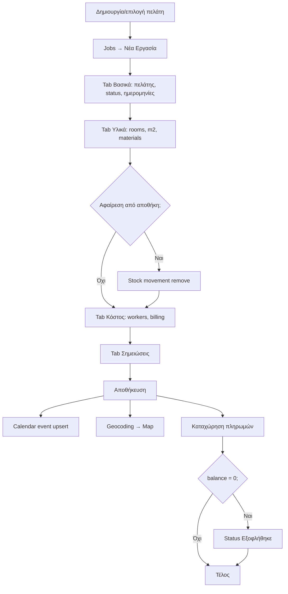
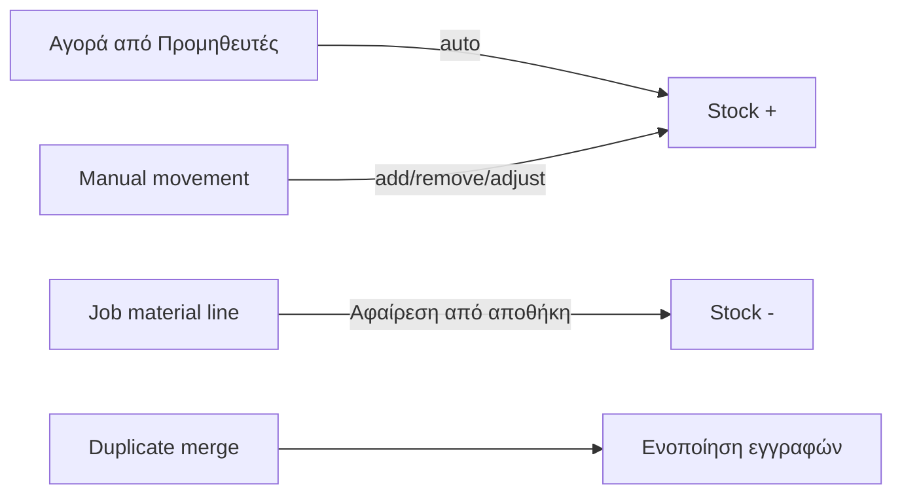
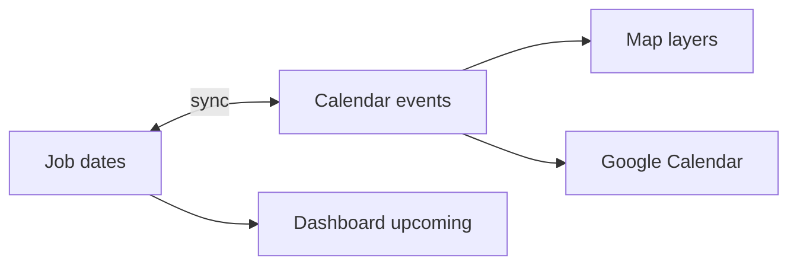

# UI Οθόνες & Workflows — Τέχνη και Χρώμα

> **Σχετικά έγγραφα:** [Αρχιτεκτονική](architecture.md) · [Βάση δεδομένων & API](database-and-api.md) · [UI/UX Redesign Plan](ui-ux-redesign-plan.md)

## Πλοήγηση

Η εφαρμογή είναι SPA με hash routing. Η πλοήγηση γίνεται από sidebar (`index.html`) και `Router.navigate()`.

### Routes

| Hash Route | View Module | Αρχείο | Sidebar |
|------------|-------------|--------|---------|
| `#dashboard` | `DashboardView` | `dashboard.js` | Ναι |
| `#jobs` | `JobsView` | `jobs.js` | Ναι |
| `#clients` | `ClientsView` | `clients.js` | Ναι |
| `#workers` | `WorkersView` | `workers.js` | Ναι |
| `#suppliers` | `SuppliersView` | `inventory.js` | Ναι |
| `#inventory` | `InventoryView` | `stock.js` | Ναι |
| `#calendar` | `CalendarView` | `calendar.js` | Ναι |
| `#map` | `MapView` | `map.js` | Ναι |
| `#statistics` | `StatisticsView` | `statistics.js` | Ναι |
| `#settings` | `SettingsView` | `settings.js` | Ναι |
| `#help` | `HelpView` | `help.js` | Ναι |
| `#offers` | `OffersView` | `offers.js` | Όχι |
| `#invoices` | `InvoicesView` | `invoices.js` | Όχι |
| `#templates` | `TemplatesView` | `templates.js` | Όχι |

**Σημαντικό:** Το route `suppliers` φορτώνει `SuppliersView` από `inventory.js`, ενώ το route `inventory` φορτώνει `InventoryView` από `stock.js` (αντιστροφή ονομάτων).

### Query Parameters

- `#jobs?jobId=123` — άνοιγμα συγκεκριμένης εργασίας
- `#settings` με `?gcal=connected` ή `?gcal=error` — feedback μετά Google OAuth

### Router Lifecycle

1. Parse route name + query params
2. Κλήση `currentView.cleanup()` αν υπάρχει
3. Ενημέρωση `State.currentSection` + sidebar active state
4. Καθάρισμα `#contentArea`
5. `view.render(container, params)`

---

## Ρόλοι Χρήστη

**Δεν υπάρχει σύστημα ρόλων ή permissions.** Ένας διαχειριστής έχει πλήρη πρόσβαση.

Η μόνη διάκριση τύπου είναι στους **εργάτες**:
- **Υπάλληλος (`employee`):** Μετράει ως payroll expense στα οικονομικά
- **Ιδιοκτήτης (`owner`):** Μετράει ως opportunity cost, όχι ως έξοδο

---

## Οθόνες — Λεπτομερής Καταγραφή

### 1. Dashboard (`#dashboard`)

**Σκοπός:** Επιχειρησιακή επισκόπηση σε μία οθόνη.

**KPI Widgets (clickable → navigation):**

| Widget | Μετρική | Κλικ → |
|--------|---------|--------|
| Εργασίες | Σύνολο / ενεργές | `#jobs` |
| Πελάτες | Σύνολο / νέοι μήνα | `#clients` |
| Προμηθευτές | Σύνολο / υπόλοιπο οφειλής | `#suppliers` |
| Αποθήκη | Πλήθος υλικών / αξία stock | `#inventory` |
| Καθαρά κέρδη μήνα | Net profit / ολοκληρωμένες | `#statistics` |

**Panels:**
- **Επόμενες επισκέψεις** — επόμενες 7 ημέρες από jobs/calendar
- **Πρόσφατες ενέργειες** — κλικ → modal εργασίας
- **Doughnut chart** — κατανομή κατάστασης εργασιών (Chart.js)
- **Mini-map** — Google Maps ή Leaflet fallback

**Ενέργειες:** Scroll-to-top, theme-aware chart refresh, server stats fetch (web via `statistics.php`).

---

### 2. Jobs (`#jobs`) — Κεντρικό Module

**Σκοπός:** Πλήρης διαχείριση εργασιών με οικονομικό cockpit.

#### Λίστα εργασιών

- Αναζήτηση (τίτλος, πελάτης, διεύθυνση)
- Φίλτρο κατάστασης
- Desktop: πίνακας με infinite scroll
- Mobile: card list (`UIPrimitives`)
- Ενέργειες ανά εγγραφή: Προβολή, Επεξεργασία, Διαγραφή

#### Καταστάσεις εργασίας

Υποψήφιος · Προγραμματισμένη · Σε εξέλιξη · Σε αναμονή · Ολοκληρώθηκε · Εξοφλήθηκε · Ακυρώθηκε

#### Τύποι εργασίας

Εσωτερικοί χώροι · Εξωτερικοί χώροι · Κάγκελα/Πέργκολα · Επαγγελματικός · Κατοικία · Μικροεπισκευή · Άλλο

#### Φόρμα δημιουργίας/επεξεργασίας — 4 Tabs

**Tab 1 — Βασικά (`basic`):**
- Πελάτης (required, autocomplete) → auto-fill διεύθυνση
- Κατάσταση
- Επόμενη επίσκεψη / ημερομηνία λήξης (πολυήμερη)
- Ολοήμερη vs χρονικό παράθυρο (start/end time)
- Τίτλος, τύπος εργασίας, διεύθυνση

**Tab 2 — Εργασία & Υλικά (`details`):**
- Δωμάτια, τετραγωνικά μέτρα
- Λίστα υλικών (`paints`) με autocomplete από αποθήκη
- Modal προσθήκης υλικού (ποσότητα, τιμή, σύνολο)
- Checkbox **«Αφαίρεση από αποθήκη»** → δημιουργία `materialStockMovements`

**Tab 3 — Κόστος & Εργάτες (`costs`):**
- Ανάθεση εργατών + ώρες
- Τύπος χρέωσης: Ωρομίσθιο ή Κατ' αποκοπή (fixed)
- Billing hours/rate ή agreed price
- Χιλιόμετρα, κόστος/km
- Live KPI strip: worked hours, charged hours, unbilled hours, lost billing value, profit
- Override κόστους υλικών (≥ άθροισμα γραμμών)
- **Πληρωμές πελάτη** (μετά την αποθήκευση): προσθήκη/επεξεργασία/διαγραφή `jobPayments`

**Tab 4 — Σημειώσεις (`notes`):**
- Ελεύθερο κείμενο

#### View Modal

- Σύνοψη εργασίας
- Οικονομική ανάλυση (`JobFinancials.compute`)
- Λίστα πληρωμών
- Κουμπί επεξεργασίας

#### Side Effects on Save

- Calendar sync (backend web / local Electron)
- Geocoding διεύθυνσης (αν χρειάζεται)
- Stock deduction (αν επιλεγεί)
- Auto status «Εξοφλήθηκε» όταν balance = 0

---

### 3. Clients (`#clients`)

**CRUD πελατών:**

| Πεδίο | Required |
|-------|----------|
| Όνομα | Ναι |
| Τηλέφωνο, email | Όχι |
| Διεύθυνση, πόλη (default: Αλεξανδρούπολη), ΤΚ | Όχι |
| ΑΦΜ, σημειώσεις | Όχι |

**Ενέργειες:**
- Προσθήκη, προβολή (modal με linked jobs + payment summary), επεξεργασία, διαγραφή (confirm)
- Αναζήτηση, infinite scroll
- Desktop table + mobile card list

**Geocoding:** On save → Nominatim (PHP proxy web / direct Electron) → `coordinates` για Map.

**Στήλη πληρωμών:** Aggregated paid/balance από όλες τις εργασίες πελάτη.

---

### 4. Workers / Προσωπικό (`#workers`)

**CRUD εργατών:**

| Πεδίο | Required |
|-------|----------|
| Όνομα | Ναι |
| Τηλέφωνο | Ναι |
| Ωρομίσθιο | Ναι |
| Τύπος (Υπάλληλος / Ιδιοκτήτης) | Όχι |
| Κατάσταση (active/inactive) | Όχι |
| Ημερομηνία πρόσληψης, σημειώσεις | Όχι |

**Μετρικές πίνακα:**
- Μηνιαίες ώρες
- Καθαρά (υπάλληλοι) ή απόδοση €/ώρα (ιδιοκτήτες)

**Ενέργειες:** Προβολή (stats + job assignments), επεξεργασία, διαγραφή, αναζήτηση, φίλτρο κατάστασης.

---

### 5. Suppliers / Προμηθευτές (`#suppliers`)

**3 Tabs:**

#### Tab «Καταστήματα»
- CRUD προμηθευτών
- Στήλες: σύνολο αγορών, πληρωμένο, υπόλοιπο

#### Tab «Αγορές»
- Φόρμα πολλαπλών γραμμών:
  - Προμηθευτής, ημερομηνία, αριθμός παραστατικού
  - Γραμμές: υλικό, κατηγορία, κωδικός χρώματος, ποσότητα, μονάδα, τιμή
  - Κατάσταση πληρωμής: Απλήρωτη / Πλήρης / Μερική
- **Side effect:** Αυτόματη αύξηση αποθήκης

#### Tab «Πληρωμές»
- Καταχώρηση/επεξεργασία πληρωμών συνδεδεμένων με προμηθευτή/αγορά

**Ενέργειες:** Modal λεπτομέρειας αγοράς, διαγραφή προμηθευτή (cascade), διαγραφή αγοράς (stock reversal), διαγραφή πληρωμής.

---

### 6. Αποθήκη (`#inventory`)

**Σκοπός:** Φυσική αποθήκη μόνο (όχι λογιστική προμηθευτών).

**Summary cards:** Πλήθος υλικών, λίτρα σε stock, συνολική αξία.

**CRUD υλικών:**

| Πεδίο | Σημείωση |
|-------|----------|
| Όνομα | Required |
| Κατηγορία | «Χρώμα» → εμφάνιση color code |
| Μονάδα, τιμή μονάδας | |
| Αρχική ποσότητα | Μόνο στη δημιουργία |

**Κινήσεις stock:**
- Τύποι: Προσθήκη / Αφαίρεση / Προσαρμογή
- Ημερομηνία, σημειώσεις, autocomplete υλικού

**Πίνακες:** Υλικά (αναζήτηση, edit, delete), ιστορικό κινήσεων (infinite scroll).

**Εργαλείο:** Modal **«Έλεγχος διπλότυπων»** → merge duplicates.

---

### 7. Calendar (`#calendar`)

**UI:** FullCalendar (Greek locale), views: μήνας/εβδομάδα/ημέρα. Sidebar επερχόμενων επισκέψεων.

**Πηγές events:**
- Job-linked visits (`nextVisit` / schedule fields)
- Manual calendar events (ανεξάρτητες επισκέψεις)
- Ελληνικές αργίες (hardcoded 2025–2026)

**Ενέργειες:**
- Κλικ event → modal (πελάτης, διεύθυνση, status, link σε job)
- Επεξεργασία (ημερομηνίες, all-day, ώρες, πελάτης, τίτλος, διεύθυνση, περιγραφή)
- Drag & drop / resize → ενημέρωση ημερομηνιών
- Διαγραφή: job-linked → επιλογή διαγραφής ολόκληρης εργασίας ή μόνο event
- **Electron:** `syncJobsToCalendar()` on load
- **Web:** Backend upsert on job save

**Google Calendar (web, Settings):** OAuth connect, manual import/sync.

**Mobile:** List view αντί για FullCalendar grid.

---

### 8. Map (`#map`)

**Layers (toggle):**
- Πελάτες (μπλε)
- Επερχόμενες επισκέψεις 7 ημερών (πράσινο)
- Σημερινές επισκέψεις (κόκκινο)

**Συμπεριφορά:**
- Google Maps primary, Leaflet/OSM fallback
- Background geocoding queue (rate-limited)
- Αποθήκευση coordinates σε client records
- Marker popups → άνοιγμα εργασίας
- Mobile scroll-to-top

---

### 9. Statistics (`#statistics`)

**Φίλτρα:**
- Περίοδος: έτος, μήνας, τρέχων/προηγούμενος μήνας, τελευταίοι 12, custom range
- Έτος, μήνας, κατάσταση, τύπος εργασίας, πελάτης

**Summary cards:**
Έσοδα, καθαρό κέρδος, περιθώριο, πλήθος εργασιών, ώρες εργασίας, μέση αξία εργασίας, απλήρωτο ποσό (+ trends vs προηγούμενη περίοδο)

**Charts:**
- Έσοδα/έξοδα/κέρδος over time
- Κατάσταση εργασιών (count/revenue/profit)
- Top 10 υλικά
- Top 10 εργασίες κατά κέρδος (κλικ → job modal)

**Data source:** `statistics.php` (web) ή client-side aggregation από SQLite (Electron).

---

### 10. Offers (`#offers`) — Placeholder

Μήνυμα «Σε ανάπτυξη…» (`UIPrimitives.emptyState`). State/API wiring υπάρχει, χωρίς UI.

---

### 11. Invoices (`#invoices`) — Placeholder

Ίδιο με Offers.

---

### 12. Templates (`#templates`) — Placeholder

Ίδιο με Offers.

---

### 13. Settings (`#settings`)

| Ενότητα | Ενέργειες |
|---------|-----------|
| **Εταιρεία** | Όνομα, ΑΦΜ, διεύθυνση, τηλέφωνο → `SettingsService` + sidebar title |
| **Προεπιλογές τιμολόγησης** | Default ωρομίσθιο, €/km |
| **Διαχείριση δεδομένων** | Export JSON, Import JSON (destructive), Export Excel (ExcelJS, multi-sheet) |
| **Sync (Electron only)** | Server URL, online status, last download/upload, pending changes, download/upload |
| **Google Calendar (web)** | Connect/disconnect OAuth, manual import |
| **Εμφάνιση** | Dark/light theme toggle |

---

### 14. Help (`#help`)

In-app ελληνική τεκμηρίωση με sidebar sections:
Εισαγωγή, πλοήγηση, πελάτες, εργασίες (λεπτομερές), εργάτες, προμηθευτές, αποθήκη, ημερολόγιο, χάρτης, στατιστικά, ρυθμίσεις, shortcuts.

---

## Οικονομικοί Κανόνες

Κοινός helper: `JobFinancials.compute()` — χρησιμοποιείται σε Jobs, Dashboard, Statistics, Workers, Clients.

### Billing (Τιμολόγηση)

| Τύπος | Υπολογισμός |
|-------|-------------|
| `hourly` | `billingHours × billingRate` |
| `fixed` | `agreedPrice` |
| Fallback | `totalCost` ή explicit `billingAmount` |

### Έξοδα

```
totalExpenses = materialsCost + employeeLaborCost + (kilometers × costPerKm)
```

- **Υπάλληλοι:** `hoursAllocated × hourlyRate` → payroll expense
- **Ιδιοκτήτης:** Ώρες μετράνε σε `ownerHours` / `ownerOpportunityCost` αλλά **δεν** προστίθενται στα έξοδα

### Κέρδος

```
profit = billingAmount - totalExpenses
economicProfit = profit - ownerOpportunityCost
balance = billingAmount - paidAmount
```

### KPI Strip (Jobs Tab 3)

| Μετρική | Περιγραφή |
|---------|-----------|
| Worked hours | Σύνολο ώρες εργατών |
| Charged hours | Χρεώσιμες ώρες |
| Unbilled hours | Worked - Charged |
| Lost billing value | Unbilled × rate |
| Profit / Economic profit | Όπως παραπάνω |

**Χωρίς ΦΠΑ** — αφαιρέθηκε από UI και υπολογισμούς.

---

## Workflows

### Workflow 1: Δημιουργία Εργασίας End-to-End



**Προαπαιτούμενα:**
1. Πελάτης στο Clients (προαιρετικά με geocoded address)
2. Υλικά στην Αποθήκη (αν θέλει stock deduction)

---

### Workflow 2: Διαχείριση Αποθήκης



**Δύο σημεία εισόδου stock:**
- **Προμηθευτές → Αγορές** (λογιστική + stock)
- **Αποθήκη → Manual** (μόνο φυσικό απόθεμα)

---

### Workflow 3: Λογιστική Προμηθευτών

1. Προσθήκη καταστήματος (tab Καταστήματα)
2. Καταχώρηση αγοράς με γραμμές υλικών
3. Επιλογή κατάστασης πληρωμής (απλήρωτη/μερική/πλήρης)
4. Καταχώρηση πληρωμών (tab Πληρωμές)
5. Dashboard widget εμφανίζει συνολικό υπόλοιπο

---

### Workflow 4: Προγραμματισμός Επισκέψεων



**Τρόποι ορισμού ημερομηνίας:**
- Στη φόρμα εργασίας (nextVisit, visitEndDate, times)
- Απευθείας στο Calendar (drag/drop, edit modal)
- Google Calendar import (web)

---

### Workflow 5: Backup & Sync

#### Web
1. Settings → Export JSON (backup.php)
2. Settings → Import JSON (destructive, confirm)
3. Settings → Export Excel (client-side ExcelJS)

#### Electron
1. Ίδια JSON/Excel export
2. Ρύθμιση Server URL
3. **Download:** Αντικαθιστά τοπικά δεδομένα από server
4. **Upload:** Στέλνει pending changes στο `sync.php`

---

### Workflow 6: Google Calendar Integration

1. Settings → Σύνδεση Google (OAuth redirect)
2. Δημιουργία app calendar «Οργανωτής Βαφέα»
3. Job save → auto sync event
4. Manual «Εισαγωγή από Google» ή bidirectional sync
5. Disconnect → διαγραφή tokens

**Διαθέσιμο μόνο σε Web** (όχι Electron).

---

## Keyboard Shortcuts

| Shortcut | Ενέργεια | Σημείωση |
|----------|----------|----------|
| `Ctrl+N` | Quick add (FAB) | FAB element λείπει από DOM |
| `Ctrl+S` | Save | Legacy `Storage.save()` |
| `Ctrl+F` | Focus global search | Desktop only, element λείπει |
| `Ctrl+Z` | Undo | State undo (10 snapshots) |
| `Ctrl+Y` | Redo | State redo |
| `Esc` | Κλείσιμο modal/sidebar | |
| `Ctrl+P` | Print | |
| `Ctrl+E` | Export | Legacy `Storage.export()` |

Shortcuts απενεργοποιούνται όταν το focus είναι σε input/textarea/select.

---

## Mobile Behavior

| Οθόνη | Desktop | Mobile |
|-------|---------|--------|
| Clients | Table + infinite scroll | Card list |
| Workers | Table | Card list |
| Jobs | Table | Card list |
| Stock materials | Table | Card list |
| Stock movements | Table | Card list |
| Inventory materials | Table | Card list |
| Suppliers tabs | Table | Card lists |
| Calendar | FullCalendar grid | List view |
| Sidebar | Collapsible | Overlay drawer |

**PWA:** Εγκατάσταση ως standalone app. Service worker για cache-bust, όχι offline CRUD.

---

## Offline Συμπεριφορά

| Context | Συμπεριφορά |
|---------|-------------|
| **Web browser** | Απαιτεί δίκτυο για PHP API. Χωρίς IndexedDB entity cache. |
| **Electron** | Πλήρες offline CRUD σε SQLite. Sync panel για push/pull. |
| **PWA** | Install + fresh deploy reload. Όχι offline data. |
| **Undo/redo** | In-memory μόνο — χάνεται σε refresh. |

---

## Feature Matrix

| Feature | UI | API/DB | Electron Sync |
|---------|-----|--------|---------------|
| Jobs | Πλήρες | Πλήρες | Ναι |
| Clients | Πλήρες | Πλήρες | Ναι |
| Workers | Πλήρες | Πλήρες | Ναι |
| Suppliers/Purchases/Payments | Πλήρες | Πλήρες | Μερικό (upload only via sync.php) |
| Stock/Movements | Πλήρες | Πλήρες | Upload only |
| Job Payments | Πλήρες (UI) | Πλήρες | Upload only |
| Job Visits | API only | Πλήρες | Upload only |
| Calendar | Πλήρες | Πλήρες | Download |
| Map | Πλήρες | — | — |
| Statistics | Πλήρες | Πλήρες | Client-side (Electron) |
| Settings/Backup | Πλήρες | Πλήρες | Download (settings) |
| Google Calendar | Web only | Πλήρες | — |
| Offers | Placeholder | CRUD έτοιμο | Download |
| Invoices | Placeholder | CRUD έτοιμο | Download |
| Templates | Placeholder | CRUD έτοιμο | Download |
| Timesheets | Stub | Legacy dropped | — |
| Global search / FAB | Κώδικας χωρίς DOM | — | — |
| Auth/Login | login.html | Πλήρες | — |

---

## Γνωστά Gaps

- Offers, Invoices, Templates: UI stubs μόνο
- `clients-refactored.js`: δεν φορτώνεται
- Help αναφέρει «Καταχώρηση Επίσκεψης» — το UI εστιάζει σε scheduled visits + payments, όχι ξεχωριστό visit-log modal
- Global search & FAB: wired στον κώδικα, λείπουν από `index.html`
- Electron download sync δεν καλύπτει suppliers, stock movements, job payments

---

## Σχετικά έγγραφα

- [Αρχιτεκτονική](architecture.md)
- [Βάση δεδομένων & API](database-and-api.md)
- [Refactor Roadmap](refactor-roadmap.md)
