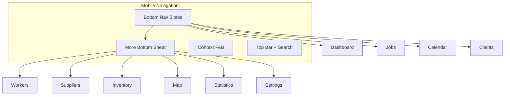
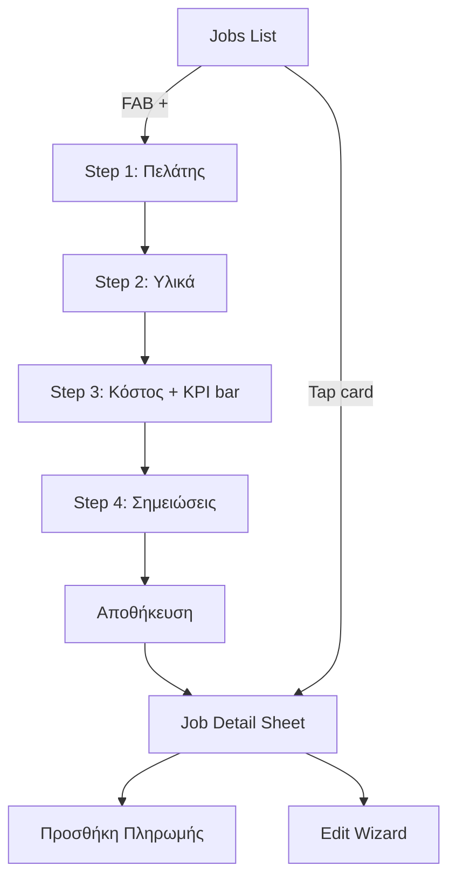

# Πλάνο UI/UX Redesign — Τέχνη και Χρώμα

> **Προαπαιτούμενα:** [Τεκμηρίωση UI & Workflows](ui-and-workflows.md) · [Αρχιτεκτονική](architecture.md) · [Refactor Roadmap](refactor-roadmap.md)  
> **Επόμενη φάση:** React Mobile App Plan (Φάση 3 — επερχόμενο)

## Στόχος

Mobile-first ανασχεδιασμός του υπάρχοντος SPA **χωρίς απώλεια λειτουργιών**. Η εφαρμογή πρέπει να λειτουργεί άψογα σε κινητό (PWA), tablet και desktop, με συνεπές design system και λιγότερο duplicated markup/CSS.

**Δεν αλλάζουμε:** API contracts, business rules, database schema, Electron sync logic.  
**Αλλάζουμε:** Layout, navigation, components, responsive patterns, visual hierarchy.

---

## Αρχές Σχεδιασμού

| Αρχή | Εφαρμογή |
|------|----------|
| **Mobile-first** | Σχεδιάζουμε για 360–430px πλάτος, μετά scale-up σε tablet/desktop |
| **Feature parity** | Κάθε λειτουργία από [ui-and-workflows.md](ui-and-workflows.md) παραμένει προσβάσιμη |
| **Progressive disclosure** | Jobs wizard, οικονομικά KPI, supplier tabs — βήμα-βήμα, όχι όλα μαζί |
| **Touch-first** | Min tap target 44×44px, sticky actions, bottom navigation σε κινητό |
| **Consistency** | Ένα pattern για list, filter, detail, form — μέσω `UIPrimitives` |
| **Desktop preserved** | Sidebar + wide tables παραμένουν σε ≥1024px |

---

## Τρέχουσα Κατάσταση (Baseline)

### Τι λειτουργεί ήδη

- Mobile card lists: Clients, Workers, Jobs, Stock, Inventory/Suppliers tabs
- Jobs: mobile sticky KPI bar, mobile detail card, 4-tab form
- Calendar: mobile list view
- Shared: `UIPrimitives` (statusBadge, emptyState, actionButton)
- CSS tokens στο [`variables.css`](../public/src/css/variables.css) + legacy aliases

### Κύρια προβλήματα UX

1. **Navigation:** Sidebar-only σε κινητό — πολλά taps για συχνές ενέργειες (Jobs, Calendar, Dashboard)
2. **Jobs form:** 4 tabs σε μικρή οθόνη, πολύ scroll, payments μόνο μετά save
3. **Horizontal table scroll:** Statistics, Dashboard widgets, Suppliers purchases — δύσχρηστα σε κινητό
4. **Έλλειψη global search / FAB:** Κώδικας υπάρχει, DOM elements λείπουν
5. **Inconsistent patterns:** Κάθε view έχει δικό filter bar, modal layout, form actions
6. **CSS debt:** Global selector collisions, inline styles, mixed legacy/canonical tokens
7. **Placeholder screens:** Offers, Invoices, Templates — empty state χωρίς roadmap στο UI

---

## Design System

Βασίζεται στα canonical tokens του [`variables.css`](../public/src/css/variables.css).

### Χρώματα & Θέματα

```
Primary:    --color-primary (#4A90E2)
Success:    --color-success
Warning:    --color-warning
Danger:     --color-danger
Surfaces:   --color-bg, --color-surface, --color-card
Text:       --color-text, --color-text-light, --color-text-muted
```

**Job status colors** (mapping σε `status-pill`):

| Status | Variant |
|--------|---------|
| Υποψήφιος | `pending` / neutral |
| Προγραμματισμένη | `scheduled` / info |
| Σε εξέλιξη | `in-progress` / primary |
| Σε αναμονή | `waiting` / warning |
| Ολοκληρώθηκε | `completed` / success |
| Εξοφλήθηκε | `paid` / success-dark |
| Ακυρώθηκε | `cancelled` / muted |

### Typography Scale

| Token | Χρήση |
|-------|-------|
| `--font-size-xs/sm` | Meta, labels, badges |
| `--font-size-base` | Body, form inputs |
| `--font-size-lg/xl` | Section titles |
| `--font-size-2xl` | Page headers, KPI values |

### Spacing & Radius

8px grid (`--spacing-*`), cards `--radius-lg`, buttons `--radius-md`, pills `--radius-full`.

### Component Library (επέκταση UIPrimitives)

Στόχος: ολοκλήρωση milestone 5 από [refactor-roadmap.md](refactor-roadmap.md).

| Primitive | API (προτεινόμενο) | Χρήση |
|-----------|-------------------|-------|
| `pageHeader({ title, actions[], breadcrumb? })` | HTML string | Κάθε οθόνη |
| `filterBar({ search, filters[], primaryAction? })` | HTML + data attrs | Lists |
| `kpiCard({ label, value, trend?, icon, onClick? })` | HTML | Dashboard, Statistics |
| `dataTable({ columns, rows, mobileCardRenderer })` | HTML | Desktop lists |
| `mobileListCard({ title, meta[], actions[], status? })` | HTML | Mobile lists |
| `formSection({ title, description?, content })` | HTML | Forms |
| `formActions({ primary, secondary, sticky? })` | HTML | Modals, wizards |
| `tabNav({ tabs[], activeId })` | HTML | Jobs, Suppliers |
| `modalDetail({ sections[] })` | HTML | View modals |
| `bottomSheet({ content })` | HTML | Mobile quick actions |
| `emptyState` | ✅ υπάρχει | Placeholders |
| `statusBadge` | ✅ υπάρχει | Lists, cards |

**Αρχείο:** Επέκταση [`ui-primitives.js`](../public/src/js/ui-primitives.js) + νέο [`components.css`](../public/src/css/components.css) section.

---

## App Shell & Navigation

### Desktop (≥1024px) — χωρίς αλλαγή δομής

```
┌──────────┬─────────────────────────────────────┐
│ Sidebar  │  Header (optional search)           │
│ 280px    ├─────────────────────────────────────┤
│          │  Content Area                       │
│ nav items│                                     │
└──────────┴─────────────────────────────────────┘
```

### Tablet (768–1023px)

- Collapsed sidebar (icons only, 64px) ή overlay drawer
- Content full width

### Mobile (<768px) — νέο shell

```
┌─────────────────────────────────────┐
│ Top bar: title + search icon + menu │
├─────────────────────────────────────┤
│                                     │
│           Content Area              │
│                                     │
├─────────────────────────────────────┤
│ Bottom Nav (5 items)                │
│ 🏠  💼  📅  👥  ⋯                   │
└─────────────────────────────────────┘
```

**Bottom navigation (5 θέσεις):**

| Icon | Route | Label |
|------|-------|-------|
| Home | `#dashboard` | Αρχική |
| Briefcase | `#jobs` | Εργασίες |
| Calendar | `#calendar` | Ημερολόγιο |
| Users | `#clients` | Πελάτες |
| More | Sheet | Περισσότερα |

**More sheet περιέχει:** Workers, Suppliers, Αποθήκη, Map, Statistics, Settings, Help.

**FAB (+):** Context-aware floating button:
- Jobs list → Νέα εργασία
- Clients → Νέος πελάτης
- Calendar → Νέο event
- Hidden σε form/edit modes

**Global search:** Προσθήκη `#globalSearch` στο header — αναζήτηση jobs/clients/materials cross-entity.



---

## Ανασχεδιασμός ανά Οθόνη

### 1. Dashboard

**Τρέχον:** 5 widgets σε row, 2-column grid, chart + map.

**Νέο mobile layout:**

```
┌─────────────────────────┐
│ Καλημέρα, [Company]     │
├─────────────────────────┤
│ [KPI scroll horizontal]   │  ← swipeable cards
│ Jobs | Clients | Profit │
├─────────────────────────┤
│ Επόμενες επισκέψεις     │  ← vertical timeline
│ ● Σήμερα 10:00 - Κώστας │
│ ● Αύριο  - Μαρία        │
├─────────────────────────┤
│ Chart: Status doughnut  │  ← full width
├─────────────────────────┤
│ Mini map (collapsible)  │
└─────────────────────────┘
```

**Desktop:** Διατήρηση widget row, βελτίωση spacing με `kpiCard` primitive.

**Acceptance:** Όλα τα widgets clickable, chart theme-aware, map lazy-load.

---

### 2. Jobs (Προτεραιότητα #1)

**Τρέχον:** Table + 4-tab modal form (~3400 lines monolith).

**List view redesign:**

| Desktop | Mobile |
|---------|--------|
| DataTable με columns | Card list (✅ exists) |
| Filter bar: search + status dropdown | Sticky filter chips (scrollable) |
| Bulk actions (future) | Swipe actions (optional phase 2b) |

**Form redesign — Wizard αντί tabs σε mobile:**

```
Mobile Job Create Flow:
Step 1/4  Πελάτης & Ημερομηνία
Step 2/4  Εργασία & Υλικά
Step 3/4  Κόστος & Εργάτες  (+ sticky KPI bar ✅)
Step 4/4  Σημειώσεις & Review

[ ← Πίσω ]  [ Επόμενο → ]  /  [ Αποθήκευση ]
```

**Desktop:** Διατήρηση 4 horizontal tabs.

**Detail view:**
- Mobile: Full-screen sheet (✅ `job-mobile-card` — polish typography, action row)
- Desktop: Modal xl

**Payments UX βελτίωση:**
- Draft mode: επιτρέπουμε προσθήκη payments πριν το πρώτο save (local draft στο form state)
- Ή: clear CTA «Αποθήκευσε πρώτα για πληρωμές» με visual step indicator

**Module split** (parallel refactor, milestone 7):

```
views/jobs/
  jobs-view.js      — list, filters
  job-form.js       — wizard/tabs
  job-detail.js     — view modal
  job-materials.js  — materials tab
  job-workers.js    — workers + KPI
  job-payments.js   — payments CRUD
  job-stock.js      — stock deduction
```

**Acceptance:** Όλες οι 7 statuses, billing types, stock deduction, calendar sync — ίδια behavior.

---

### 3. Clients

**Τρέχον:** Table + mobile cards (✅).

**Βελτιώσεις:**
- Unified `filterBar` + `pageHeader`
- Detail modal → mobile full-screen με sections: Στοιχεία | Εργασίες | Πληρωμές
- Quick action: «Νέα εργασία για αυτόν τον πελάτη» → `#jobs?clientId=X`

---

### 4. Workers

**Τρέχον:** Table + mobile cards (✅).

**Βελτιώσεις:**
- Employee vs Owner visual distinction (icon/badge στο card)
- Detail view: stats chart (monthly hours) — responsive full width
- Filter chips: active/inactive/all

---

### 5. Suppliers (`inventory.js`)

**Τρέχον:** 3 tabs, tables με horizontal scroll.

**Mobile redesign:**

```
┌─────────────────────────┐
│ [Καταστήματα|Αγορές|Πληρ.]│  ← segmented control (sticky)
├─────────────────────────┤
│ Tab content             │
│ - Card list per entity  │
│ - Purchase: card per    │
│   purchase με balance   │
└─────────────────────────┘
```

**Purchase form:** Multi-step σε mobile (header → γραμμές → πληρωμή).

---

### 6. Αποθήκη (`stock.js`)

**Τρέχον:** Summary cards + 2 tables.

**Mobile:**
- Summary cards → 2-column grid compact
- Materials: card list (✅)
- Movements: card list (✅)
- Duplicate merge: full-screen modal

---

### 7. Calendar

**Τρέχον:** FullCalendar desktop, list mobile.

**Βελτιώσεις:**
- Mobile: Agenda list ως default, optional compact month picker
- Event detail → bottom sheet με actions (Edit, Go to Job, Delete)
- Drag/drop: desktop only (disable σε touch για αποφυγή accidents)
- Upcoming sidebar → integrated στην mobile list header

---

### 8. Map

**Τρέχον:** Full map + layer toggles.

**Mobile:**
- Map 100vh minus bottom nav
- Layer toggles → FAB menu ή bottom chip bar
- Marker popup → bottom sheet

---

### 9. Statistics

**Τρέχον:** Filters + cards + charts — horizontal scroll issues.

**Mobile redesign:**
- Filters → collapsible panel («Φίλτρα ▼»)
- Summary cards → 2-column grid
- Charts → full width, reduced height, scroll vertical
- Top 10 lists → card list αντί table

---

### 10. Settings

**Τρέχον:** Card sections stacked.

**Mobile:** Accordion sections, sticky save buttons per section.

**Sections unchanged:** Company, Pricing, Backup, Sync (Electron), Google Calendar, Theme.

---

### 11. Help

**Τρέχον:** Sidebar sections.

**Mobile:** Accordion / single column, search within help content.

---

### 12. Placeholders (Offers, Invoices, Templates)

**Phase 2a:** Polished empty state με «Έρχεται σύντομα» + link to Help.  
**Phase 2b (optional):** Βασικό CRUD UI αν προλάβουμε — backend έτοιμο.

---

## Implementation Milestones

### Milestone A — Foundation (1–2 εβδομάδες)

**Στόχος:** Shell + primitives, zero feature regression.

| Task | Αρχεία |
|------|--------|
| Επέκταση `UIPrimitives` (pageHeader, filterBar, kpiCard, formSection, tabNav) | `ui-primitives.js`, `components.css` |
| Mobile bottom nav + More sheet | `index.html`, `sidebar.js` → `app-shell.js` |
| Global search DOM + wiring | `index.html`, `app.js`, `search.js` |
| Context FAB | `index.html`, `app.js` |
| Canonical tokens only σε νέα CSS (όχι removal aliases ακόμα) | `variables.css` |

**Done when:** Bottom nav λειτουργεί, FAB ανοίγει σωστό modal ανά route, lint passes.

---

### Milestone B — List Screens (1–2 εβδομάδες)

**Στόχος:** Ενιαίο list pattern σε όλες τις οθόνες.

| Order | Screen | Tasks |
|-------|--------|-------|
| 1 | Clients | filterBar, detail sections, quick job action |
| 2 | Workers | filterBar, type badges |
| 3 | Suppliers | segmented tabs, card lists all tabs |
| 4 | Inventory/Stock | unified summary + lists |

**Done when:** Καμία οθόνη list δεν χρειάζεται horizontal scroll σε 375px.

---

### Milestone C — Jobs Redesign (2–3 εβδομάδες)

**Στόχος:** Καλύτερο mobile wizard + module split.

| Task | Λεπτομέρεια |
|------|-------------|
| Mobile step wizard | Progress indicator, back/next |
| Sticky KPI bar polish | Consistent tokens |
| Detail full-screen sheet | Action row |
| Split `jobs.js` | 7 modules |
| Payment UX | Draft ή clear step messaging |

**Done when:** Full job workflow tested mobile + desktop, `npm test` passes.

---

### Milestone D — Dashboard, Calendar, Statistics (1–2 εβδομάδες)

| Screen | Key change |
|--------|------------|
| Dashboard | Horizontal KPI scroll, timeline visits |
| Calendar | Bottom sheet events, touch-safe |
| Statistics | Collapsible filters, responsive charts |
| Map | Layer chip bar |

---

### Milestone E — Polish & Cleanup (1 εβδομάδα)

- Αφαίρεση inline styles → CSS classes
- Scope CSS selectors (`.jobs-view .detail-grid`)
- Help accordion mobile
- Settings accordion
- QA pass: iOS Safari, Android Chrome, desktop Chrome/Firefox
- Accessibility: focus states, aria labels, contrast check

---

## Wireframe Flow — Job Creation (Mobile)



---

## Testing Checklist (ανά Milestone)

### Functional (must not break)

- [ ] CRUD: clients, workers, jobs, materials, suppliers, purchases, payments
- [ ] Job financials: hourly + fixed billing, owner vs employee
- [ ] Stock deduction from job materials
- [ ] Calendar sync on job save
- [ ] Geocoding on client save
- [ ] Google Calendar OAuth (web)
- [ ] Electron sync panel (unchanged)
- [ ] JSON/Excel backup import/export
- [ ] Dark/light theme toggle

### Responsive

- [ ] 375px (iPhone SE)
- [ ] 390px (iPhone standard)
- [ ] 768px (tablet)
- [ ] 1280px+ (desktop)
- [ ] PWA installed mode
- [ ] Landscape orientation

### Performance

- [ ] Jobs list 100+ items — infinite scroll smooth
- [ ] Map lazy load — no blocking boot
- [ ] Chart re-render on theme change

---

## Τι ΔΕΝ κάνουμε σε αυτή τη φάση

- Μεταφορά σε React/Vue (αυτό είναι Φάση 3)
- Αλλαγές API/database
- Υλοποίηση Offers/Invoices/Templates CRUD (εκτός αν Milestone 2b)
- Offline web caching (PWA data)
- Multi-user / roles

---

## Σύνδεση με React Mobile (Φάση 3)

Το redesign αυτό **θωρακίζει** το React app:

| Web SPA (Φάση 2) | React Mobile (Φάση 3) |
|------------------|------------------------|
| Bottom nav 5 items | Native tab navigator — ίδια IA |
| UIPrimitives patterns | React components — ίδιο design system |
| Job wizard steps | React screens — ίδια flow |
| `JobFinancials` JS | Shared TypeScript module |
| PHP API | Ίδιο API — zero backend changes |

---

## Εκτίμηση Χρόνου

| Milestone | Διάρκεια |
|-----------|----------|
| A — Foundation | 1–2 εβδομάδες |
| B — List screens | 1–2 εβδομάδες |
| C — Jobs | 2–3 εβδομάδες |
| D — Dashboard/Calendar/Stats | 1–2 εβδομάδες |
| E — Polish | 1 εβδομάδα |
| **Σύνολο** | **6–10 εβδομάδες** |

---

## Επόμενα βήματα

1. **Έγκριση** αυτού του πλάνου (IA, bottom nav, milestones)
2. **Έναρξη Milestone A** — bottom nav, FAB, global search, UIPrimitives
3. Μετά την ολοκλήρωση Φάσης 2 → React Mobile Plan (Φάση 3)

---

## Σχετικά έγγραφα

- [UI & Workflows](ui-and-workflows.md)
- [Αρχιτεκτονική](architecture.md)
- [Refactor Roadmap](refactor-roadmap.md)
